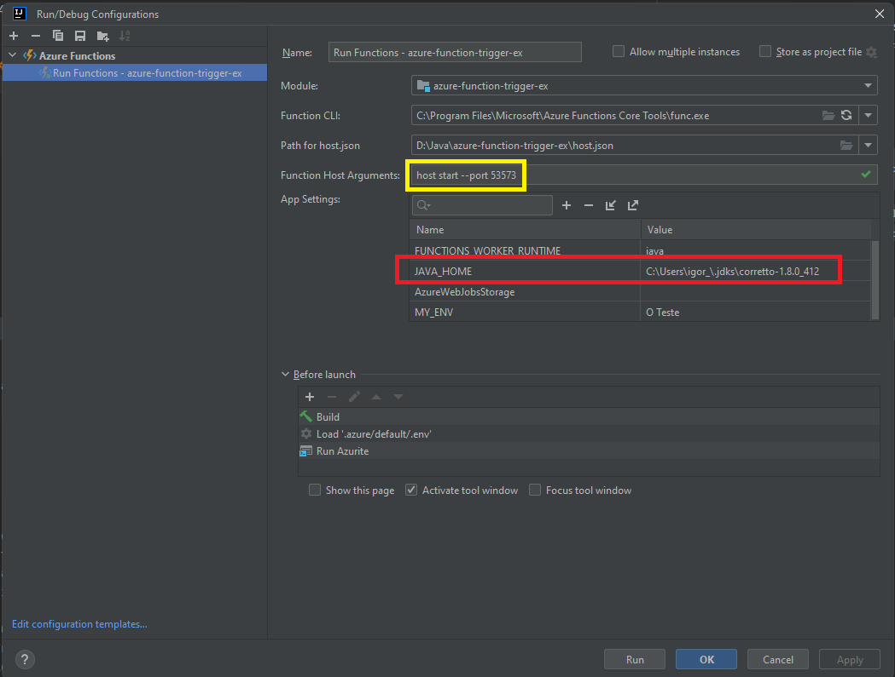

# azure-functions-ex

### Steps
1 - Instalar Azure Toolkit no ```IntelliJ``` <br>
2 - Instalar Azure Functions Core Tools (ajustar no ```IntelliJ``` o folder da instalação) <br>
3 - Run Azurite do ```docker-composer.yml``` <br>
4 - Setar ```JAVA_HOME``` nas ENV's do run <br>
5 - Run na function


### URL's
    - OBS: Porta é configurada no RUN do IntelliJ

 - Listar functions: GET ```http://localhost:<port>/admin/functions```
 - Disparar function: POST ```http://localhost:<port>/admin/functions/:function```

